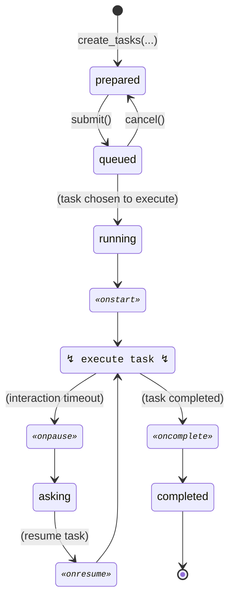

# Overview

Roo-Code is a nice AI agent that can help you write code. But one can request it
one task at a time. Roo-Spawn solves this problem by maintaining a queue of tasks
and conducting their execution by Roo-Code.

### Import RooSpawn module

```python
import roospawn
```

### Create a visualization of the queue

To create a visualization of the queue, use `roospawn.live_preview()` function.
It **must** be the last statement of notebook cell to be rendered correctly.

```python
roospawn.live_preview()
```

### Create tasks

Use `roospawn.create_tasks` to create tasks.

```python
tasks = roospawn.create_tasks(["First task", "Second task"], mode="code")
```

### Add tasks to the queue

To add tasks to the queue, use `submit` method.

```python
for task in tasks:
    task.submit()
```

Now the tasks should change their status to `queued` — and instantly — the first
one to `running` and it should start executing.


## Hooks

Not all tasks can be finished without user interaction. Usually the user will
set reasonable "auto-approve" settings, but sometimes the AI agent will ask for
an action of of the auto-approve scope.
Roo-Spawn handles such cases by "pausing" the task execution and moving to the
next tasks. When the user gets back to the computer, one can resume the paused
task and approve the needed actions manually.

Such tasks pausing requires dealing with partially completed tasks. Roo-Spawn
uses hooks to manage the working directory state.

There are four hooks: `onstart`, `oncomplete`, `onpause`, `onresume`.

Each hook is a Python function that can run arbitrary Python code. If hook function
returns a string, it will be treated as a shell command and executed.

We can for example use `oncomplete` hook to commit changes done by AI agent
to the repository.

```python
@roospawn.oncomplete
def oncomplete(task: roospawn.Task):
    return f"git add -A && git commit -m 'Commit changes done by {task.id}'"
```

See [workflows](./workflows.md) page for more examples.

## Task lifecycle

The below state diagram shows the lifecycle of a task.

